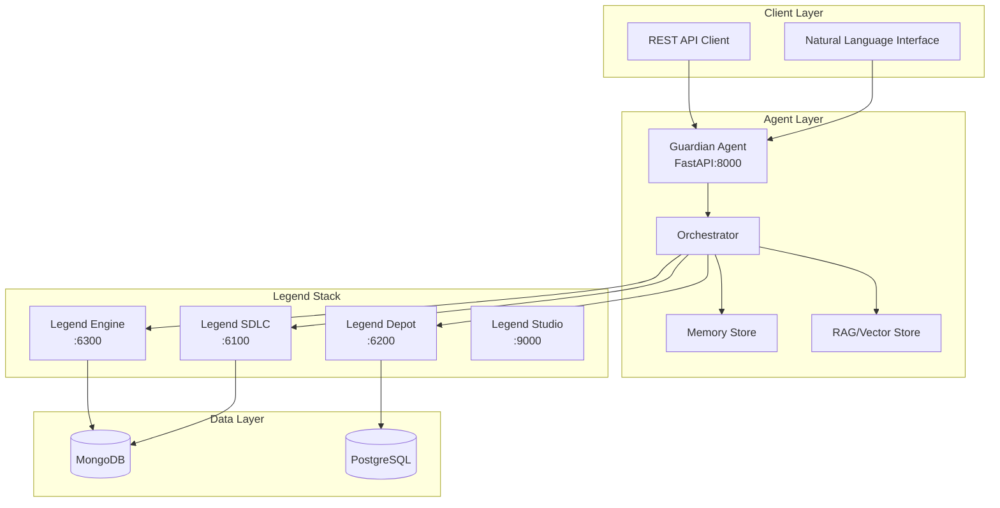

# Legend Guardian Workspace

A production-grade agent and deployment environment for orchestrating FINOS Legend stack operations through natural language interfaces.

## Architecture



## Features

- **Natural Language Processing**: Convert user intents into Legend operations
- **Multi-Service Orchestration**: Coordinate across Engine, SDLC, and Depot
- **PURE Compilation & Validation**: Real-time model validation
- **Automated PR/Review Management**: GitLab integration for code reviews
- **Service Generation & Publishing**: Automatic REST API generation
- **Audit Trail**: Complete action logging and artifact generation
- **RAG-Enhanced Context**: Leverage organizational knowledge base
- **Policy Enforcement**: Guardrails for compliance and security

## Quick Start

### Prerequisites

- Docker & Docker Compose
- Python 3.11+
- Legend Stack (included via Docker Compose)

### Option 1: Docker Compose (Recommended)

```bash
# Clone the repository
git clone <repo-url>
cd legend-guardian-workspace

# Navigate to local deployment
cd deploy/local

# Check if .env already exists
if [ ! -f .env ]; then
  cp env.example .env
  echo "Created new .env file from env.example"
else
  echo ".env already exists, skipping creation"
fi

# Edit .env with your configuration (if needed)

# Start full Legend stack + Agent
docker compose --profile full up -d

# Check status
docker compose --profile full ps

# View logs
docker compose --profile full logs -f
```

### Option 2: Official FINOS Deployment

```bash
# Navigate to official deployment
cd deploy/docker-finos-official

# Configure GitLab OAuth (required)
cp .env.example .env.local
# Edit .env.local with GITLAB_APP_ID and GITLAB_APP_SECRET

# Run setup and start services
./run-legend.sh setup up
./run-legend.sh studio up -d

# Access Legend Studio at http://localhost:9000
```

### Option 3: Development Mode

```bash
# Start only Legend services
cd deploy/local
docker compose up -d

# Run agent in development mode (from project root)
cd ../..
make -C legend-guardian-agent dev
```

## Access Points

Once running, access the services:

- **Legend Guardian Agent**: http://localhost:8000
  - API Docs: http://localhost:8000/docs
  - ReDoc: http://localhost:8000/redoc
- **Legend Studio**: http://localhost:9000
- **Legend Engine**: http://localhost:6300
- **Legend SDLC**: http://localhost:6100
- **Legend Depot**: http://localhost:6200
- **MongoDB**: localhost:27017
- **PostgreSQL**: localhost:5432

## Use Cases

The agent supports 8 primary use cases:

1. **Ingest → Model → Map → Publish Service**: End-to-end data pipeline
2. **Model Change with Safe Rollout**: Versioned schema evolution
3. **Cross-bank Model Reuse via Depot**: Leverage shared models
4. **Reverse ETL → Data Product**: Database to API transformation
5. **Governance Audit & Lineage Proof**: Compliance documentation
6. **Contract-first API**: Schema-driven development
7. **Bulk Backfill & Regression**: Large-scale data processing
8. **Incident Response / Rollback**: Emergency recovery procedures

## Project Structure

```
legend-guardian-workspace/
├── deploy/                        # Deployment configurations
│   ├── docker-finos-official/    # Official FINOS Legend deployment
│   │   ├── run-legend.sh         # Main deployment script
│   │   ├── docker-compose.yml    # FINOS services
│   │   └── z_generated/          # Auto-generated configs
│   ├── local/                    # Local development deployment
│   │   ├── docker-compose.yml    # Full stack + agent
│   │   └── README.md            # Local setup guide
│   └── k8s/                      # Kubernetes manifests
├── legend-guardian-agent/         # Agent source code
│   ├── src/                      # Source code
│   │   ├── api/                 # FastAPI application
│   │   ├── agent/               # Orchestration logic
│   │   ├── clients/             # Legend service clients
│   │   └── rag/                 # RAG/Vector store
│   ├── tests/                   # Test suite
│   ├── scripts/                 # Utility scripts
│   └── artifacts/               # Generated artifacts
│       ├── harness/            # Test harness scripts
│       └── docs/               # Documentation
├── docs/                         # Workspace documentation
│   └── architecture.md         # System architecture
├── CLAUDE.md                    # AI assistant guidelines
└── README.md                    # This file
```

## Configuration

Environment variables (see `deploy/local/env.example`):

```bash
# Legend Services
ENGINE_URL=http://localhost:6300
SDLC_URL=http://localhost:6100
DEPOT_URL=http://localhost:6200
STUDIO_URL=http://localhost:9000

# Agent Configuration
AGENT_URL=http://localhost:8000
API_KEY=demo-key
PROJECT_ID=demo-project
WORKSPACE_ID=terry-dev

# Security
VALID_API_KEYS=demo-key,prod-key
ENGINE_TOKEN=<token>
SDLC_TOKEN=<token>
DEPOT_TOKEN=<token>

# GitLab OAuth (for FINOS deployment)
GITLAB_APP_ID=<your-app-id>
GITLAB_APP_SECRET=<your-app-secret>

# Observability
OTEL_EXPORTER_OTLP_ENDPOINT=http://localhost:4317
LOG_LEVEL=INFO
```

## Testing

```bash
# Run unit tests
cd legend-guardian-agent
make test

# Run specific test
pytest tests/test_engine_client.py -v

# Run test harness (all use cases)
make harness

# Run individual use case
bash artifacts/harness/usecase1_ingest_publish.sh

# Test all endpoints
./test_all_endpoints.sh
```

## Development

### Code Style

```bash
cd legend-guardian-agent

# Format code
make format

# Lint
make lint

# Type check
make typecheck
```

### Adding New Features

1. Create feature branch: `git checkout -b feature/new-feature`
2. Implement changes with tests
3. Update OpenAPI spec if needed
4. Run full test suite: `make test`
5. Update documentation
6. Submit PR with description

## API Endpoints

### Core Endpoints

- `GET /health` - Health check with dependency status
- `POST /intent` - Process natural language intent
- `POST /adapters/engine/compile` - Compile PURE code
- `POST /adapters/sdlc/workspaces/{id}` - Create workspace
- `GET /adapters/depot/search` - Search depot models

See full OpenAPI specification at `/docs` when running.

## Deployment Options

### Docker Compose (Local)

```bash
# Navigate to local deployment
cd deploy/local

# Start core services
docker compose up -d

# Start with agent
docker compose --profile full up -d

# View logs
docker compose logs -f legend-guardian-agent
```

### Kubernetes (AKS)

```bash
# Create namespace
kubectl apply -f deploy/k8s/namespace.yaml

# Deploy secrets (configure Key Vault first)
kubectl apply -f deploy/k8s/secrets.yaml

# Deploy agent
kubectl apply -f deploy/k8s/

# Check status
kubectl get pods -n legend-guardian
kubectl logs -f deployment/legend-guardian-agent -n legend-guardian
```

## Monitoring

- Health endpoint aggregates all service dependencies
- OpenTelemetry traces for request flow
- Structured logging with correlation IDs
- Metrics exported to Azure Monitor (production)

## Security

- Bearer token authentication for all endpoints
- Secret management via Azure Key Vault (production)
- PII redaction in logs
- Network policies for service isolation
- Automated vulnerability scanning in CI/CD

## Troubleshooting

### OAuth Authentication Failures (FINOS deployment)
1. Verify GITLAB_APP_ID and GITLAB_APP_SECRET in `.env.local`
2. Check GitLab OAuth app has "Confidential" checked
3. Ensure redirect URIs match exactly: `http://localhost:6100/api/auth/callback`
4. Clear browser cookies and try incognito mode

### Service Startup Issues
1. Ensure setup service completes: `./run-legend.sh setup up` (FINOS) or check docker-compose logs
2. Check MongoDB is healthy: `docker logs legend-mongodb`
3. Verify configuration files exist
4. Review service logs: `docker compose logs -f <service-name>`

### Clean Rebuild
```bash
# For local deployment
cd deploy/local
docker compose --profile full down -v

# For FINOS deployment
cd deploy/docker-finos-official
./run-legend.sh studio down -v
./run-legend.sh setup up
./run-legend.sh studio up -d
```

## Support

- Documentation: `legend-guardian-agent/artifacts/docs/`
- Runbook: `legend-guardian-agent/artifacts/docs/runbook.md`
- Use Cases: `legend-guardian-agent/artifacts/docs/usecases.md`
- Architecture: `docs/architecture.md`
- Issues: Create issue in repository

## License

Apache 2.0 - See LICENSE file

## Contributing

Please read CONTRIBUTING.md for development guidelines and submission process.