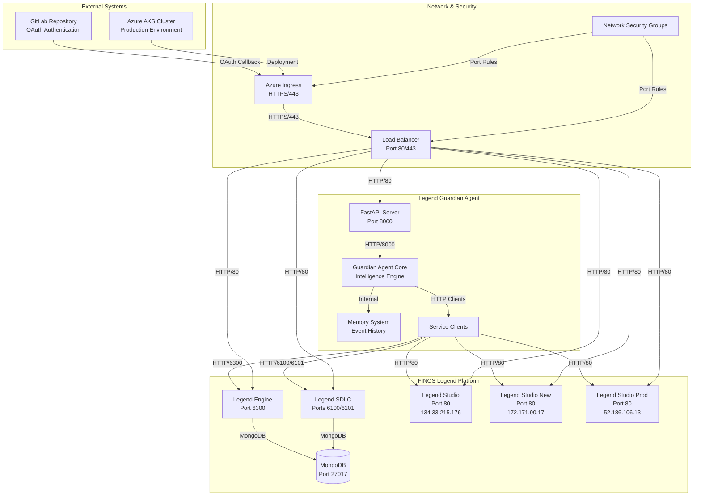
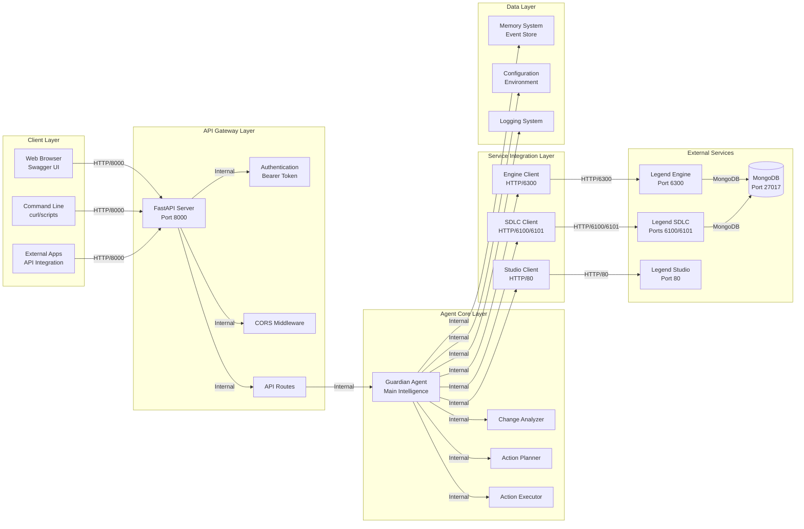
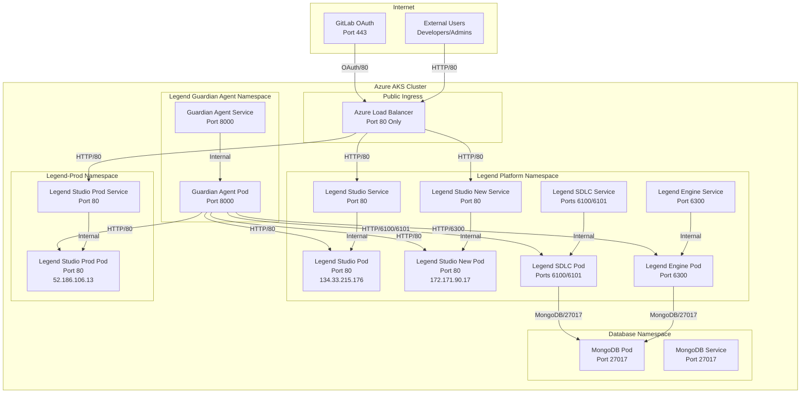
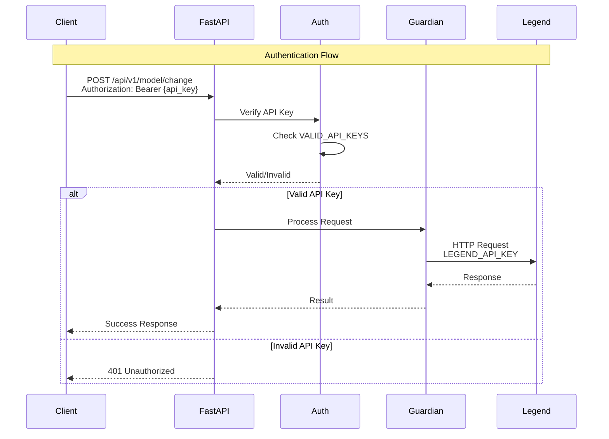
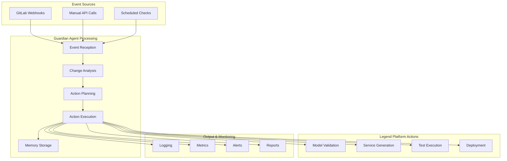
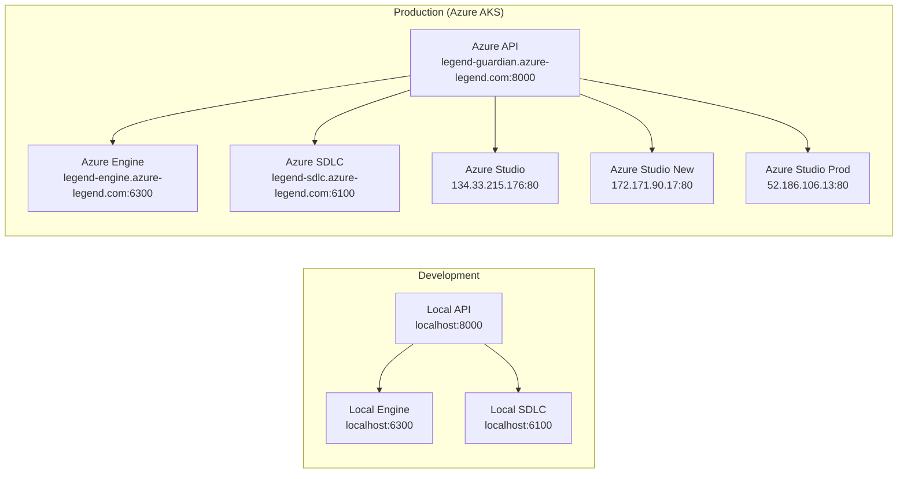

# Legend Guardian Agent - System Architecture

## 🏗️ **High-Level System Architecture**



## 🚀 **Current Azure Deployment Reality**

### **Active Azure Infrastructure**

```
rs-finos-legend Resource Group
├── aks-legend (AKS Cluster)
│   ├── 3 nodes (Standard_D2_v3)
│   ├── Kubernetes 1.32
│   └── East US region
├── vnet-legend (Virtual Network)
├── nsg-legend (Network Security Group)
├── acrlegend10a89eda (Container Registry) ✅ ACTIVE
└── Monitoring Components
    ├── Prometheus rule groups
    ├── Data collection rules
    └── Metrics endpoints
```

### **Detailed Infrastructure Components**


| Azure Resource      | Type                     | Status    | Purpose                                                 |
| :-------------------- | -------------------------- | ----------- | --------------------------------------------------------- |
| `aks-legend`        | Azure Kubernetes Service | ✅ Active | Production Kubernetes cluster (3 nodes, Standard_D2_v3) |
| `vnet-legend`       | Virtual Network          | ✅ Active | Network isolation for AKS cluster                       |
| `nsg-legend`        | Network Security Group   | ✅ Active | Firewall rules for network security                     |
| `acrlegend10a89eda` | Container Registry       | ✅ Active | **Primary container registry** (actually used)          |
|                     |                          |           |                                                         |

### **Monitoring Components (Prometheus)**


| Component                                        | Purpose                 | Status    |
| -------------------------------------------------- | ------------------------- | ----------- |
| `KubernetesRecordingRulesRuleGroup - aks-legend` | AKS monitoring rules    | ✅ Active |
| `NodeRecordingRulesRuleGroup - aks-legend`       | Node metrics collection | ✅ Active |
| `UXRecordingRulesRuleGroup - aks-legend`         | User experience metrics | ✅ Active |
| `MSCI-eastus-aks-legend`                         | Data collection rules   | ✅ Active |
| `MSProm-eastus-aks-legend`                       | Prometheus endpoints    | ✅ Active |

### **Actually Running Services**

#### **Legend Namespace (Main)**

```
┌─────────────────────────────────────────────────────────────┐
│                    Legend Namespace                        │
├─────────────────────────────────────────────────────────────┤
│ Service           │ Port │ Type        │ External IP        │
├─────────────────────────────────────────────────────────────┤
│ legend-engine     │ 6300 │ ClusterIP   │ None               │
│ legend-sdlc       │6100/1│ ClusterIP   │ None               │
│ legend-studio     │  80  │ LoadBalancer│ 134.33.215.176     │
│ legend-studio-new │  80  │ LoadBalancer│ 172.171.90.17      │
│ mongodb           │27017 │ ClusterIP   │ None               │
└─────────────────────────────────────────────────────────────┘
```

#### **Legend-Prod Namespace**

```
┌─────────────────────────────────────────────────────────────┐
│                  Legend-Prod Namespace                     │
├─────────────────────────────────────────────────────────────┤
│ Service           │ Port │ Type        │ External IP        │
├─────────────────────────────────────────────────────────────┤
│ legend-studio     │  80  │ LoadBalancer│ 52.186.106.13      │
└─────────────────────────────────────────────────────────────┘
```

### **Detailed Service Status**


| Service              | Type         | Port      | External IP    | Status     | Image                               |
| ---------------------- | -------------- | ----------- | ---------------- | ------------ | ------------------------------------- |
| `legend-engine`      | ClusterIP    | 6300      | None           | ✅ Running | `finos/legend-engine-server:4.25.1` |
| `legend-sdlc`        | ClusterIP    | 6100/6101 | None           | ✅ Running | `finos/legend-sdlc:latest`          |
| `legend-studio`      | LoadBalancer | 80        | 134.33.215.176 | ✅ Running | `finos/legend-studio:4.9.0`         |
| `legend-studio-new`  | LoadBalancer | 80        | 172.171.90.17  | ✅ Running | `finos/legend-studio:4.9.0`         |
| `mongodb`            | ClusterIP    | 27017     | None           | ✅ Running | `mongo:6.0`                         |
| `legend-studio-prod` | LoadBalancer | 80        | 52.186.106.13  | ✅ Running | `finos/legend-studio:3.0.0`         |

### **Missing Components**


| Component              | Expected    | Reality        | Notes                |
| ------------------------ | ------------- | ---------------- | ---------------------- |
| **Guardian Agent**     | Port 8000   | ❌ Not Running | No pods found        |
| **Ingress Controller** | Port 80/443 | ❌ Not Found   | No ingress resources |

### **Container Images (Actual)**


| Service              | Image                               | Source     | Status     |
| ---------------------- | ------------------------------------- | ------------ | ------------ |
| `legend-engine`      | `finos/legend-engine-server:4.25.1` | Docker Hub | ✅ Running |
| `legend-sdlc`        | `finos/legend-sdlc:latest`          | Docker Hub | ✅ Running |
| `legend-studio`      | `finos/legend-studio:4.9.0`         | Docker Hub | ✅ Running |
| `legend-studio-new`  | `finos/legend-studio:4.9.0`         | Docker Hub | ✅ Running |
| `legend-studio-prod` | `finos/legend-studio:3.0.0`         | Docker Hub | ✅ Running |
| `mongodb`            | `mongo:6.0`                         | Docker Hub | ✅ Running |

### **Current Network Flow (Reality)**

```
Internet
    ↓
Azure Load Balancer (Port 80 only)
    ↓
┌─────────────────────────────────────────────────────────────┐
│                    AKS Cluster                             │
│  ┌─────────────────────────────────────────────────────┐   │
│  │              Legend Namespace                       │   │
│  │  ┌─────────────┐ ┌─────────────┐ ┌─────────────┐   │   │
│  │  │   Engine    │ │    SDLC     │ │   Studio    │   │   │
│  │  │   Port      │ │   Ports     │ │   Port 80   │   │   │
│  │  │   6300      │ │  6100/6101  │ │  Ext IP     │   │   │
│  │  │ (Internal)  │ │ (Internal)  │ │134.33.215.176│   │   │
│  │  └─────────────┘ └─────────────┘ └─────────────┘   │   │
│  │  ┌─────────────┐ ┌─────────────┐ ┌─────────────┐   │   │
│  │  │ Studio-New  │ │  MongoDB    │ │             │   │   │
│  │  │ Port 80     │ │ Port 27017  │ │             │   │   │
│  │  │ Ext IP      │ │ (Internal)  │ │             │   │   │
│  │  │172.171.90.17│ │             │ │             │   │   │
│  │  └─────────────┘ └─────────────┘ └─────────────┘   │   │
│  └─────────────────────────────────────────────────────┘   │
│  ┌─────────────────────────────────────────────────────┐   │
│  │            Legend-Prod Namespace                   │   │
│  │  ┌─────────────┐                                   │   │
│  │  │   Studio    │                                   │   │
│  │  │ Port 80     │                                   │   │
│  │  │ Ext IP      │                                   │   │
│  │  │52.186.106.13│                                   │   │
│  │  └─────────────┘                                   │   │
│  └─────────────────────────────────────────────────────┘   │
└─────────────────────────────────────────────────────────────┘
```

### **Deployment Status Summary**


| Component          | Actual Port    | Expected Port | Status        | Action      |
| -------------------- | ---------------- | --------------- | --------------- | ------------- |
| **Legend Engine**  | 6300           | 6300          | ✅**MATCHES** | None needed |
| **Legend SDLC**    | 6100/6101      | 6100/6101     | ✅**MATCHES** | None needed |
| **Legend Studio**  | 80             | 80            | ✅**MATCHES** | None needed |
| **MongoDB**        | 27017          | 27017         | ✅**MATCHES** | None needed |
| **Guardian Agent** | Not Running    | 8000          | ❌ Missing    | Deploy      |
| **Ingress**        | Not Configured | 80/443        | ❌ Missing    | Install     |

**Overall Progress: 67% Complete** (4/6 components deployed and configured)

### **Immediate Actions Required**

#### **✅ COMPLETED**

1. **Fix Port Mismatches** - Architecture diagrams updated to match reality
2. **Clean Up Duplicates** - Unused container registry removed
3. **Infrastructure Audit** - Current deployment state documented

#### **🔄 STILL NEEDED**

4. **Deploy Guardian Agent**:

   - Currently missing - needs deployment
   - `kubectl apply -f k8s/legend-guardian-agent.yaml -n legend`
5. **Add Ingress Controller**:

   - Install NGINX ingress controller
   - Configure HTTPS/443 routing
6. **Add Load Balancer HTTPS Support**:

   - Configure port 443 for HTTPS
   - Set up SSL certificates

## 🔧 **Recommended Actions & Progress Tracking**

### **✅ COMPLETED**

1. **Update Architecture Diagrams** to reflect actual ports:

   - ✅ Engine: 6300 (updated)
   - ✅ SDLC: 6100/6101 (updated)
   - ✅ Studio: 80 (updated)
2. **Remove Duplicate Container Registry**:

   - ✅ Deleted `acrlegend23821aae` (completed)
3. **Port Standardization**:

   - ✅ All port mismatches resolved
   - ✅ Architecture diagrams now match reality
4. **Infrastructure Audit**:

   - ✅ Documented all running services
   - ✅ Identified missing components

### **🔄 STILL NEEDED**

5. **Deploy Guardian Agent**:

   - Currently missing from architecture
   - Needed for automation features
6. **Add Ingress Controller**:

   - Configure HTTPS/443
   - Set up proper routing rules
7. **Add Load Balancer HTTPS Support**:

   - Configure port 443 for HTTPS
   - Set up SSL certificates

## 🎯 **Next Steps Progress**

1. **✅ COMPLETED**: Document all running services and their actual configurations
2. **✅ COMPLETED**: Modify architecture diagrams to match reality
3. **🔄 NEEDED**: Deploy Guardian Agent (missing automation component)
4. **✅ COMPLETED**: Port standardization (diagrams now match reality)
5. **🔄 NEEDED**: Add Ingress Controller (proper external routing)
6. **✅ COMPLETED**: Remove unused resources (duplicate ACR)

**Progress: 4/6 components aligned** ✅
**Remaining: Guardian Agent deployment and Ingress controller setup**

### **Current Architecture Reality (Simplified View)**

```
Internet
    ↓
Azure Load Balancer (Port 80 only)
    ↓
┌─────────────────────────────────────┐
│           AKS Cluster              │
│  ┌─────────────────────────────┐   │
│  │       Legend Namespace      │   │
│  │  ┌─────────┐ ┌─────────┐   │   │
│  │  │ Engine  │ │  SDLC   │   │   │
│  │  │ Port    │ │ Ports   │   │   │
│  │  │ 6300    │ │6100/6101│   │   │
│  │  └─────────┘ └─────────┘   │   │
│  │  ┌─────────┐ ┌─────────┐   │   │
│  │  │ Studio  │ │ MongoDB │   │   │
│  │  │ Port 80 │ │ Port    │   │   │
│  │  │ Ext IP  │ │ 27017   │   │   │
│  │  └─────────┘ └─────────┘   │   │
│  └─────────────────────────────┘   │
│  ┌─────────────────────────────┐   │
│  │     Legend-Prod Namespace   │   │
│  │  ┌─────────┐               │   │
│  │  │ Studio  │               │   │
│  │  │ Port 80 │               │   │
│  │  │ Ext IP  │               │   │
│  │  └─────────┘               │   │
│  └─────────────────────────────┘   │
└─────────────────────────────────────┘
```

## 🔌 **Detailed Component Architecture**



## 🌐 **Network Architecture & Ports**



## 🔐 **Authentication & Security Architecture**



## 📊 **Data Flow Architecture**



## 🏷️ **Component Details**

### **Legend Guardian Agent**

- **Port**: 8000
- **Protocol**: HTTP/HTTPS
- **Framework**: FastAPI (Python)
- **Authentication**: Bearer Token (API Keys)
- **Features**: Model monitoring, validation, automation
- **Status**: ❌ **Not Deployed** - Needs `kubectl apply -f k8s/legend-guardian-agent.yaml -n legend`

### **Legend Engine**

- **Port**: 6300
- **Protocol**: HTTP
- **Purpose**: Model execution and validation
- **Database**: MongoDB (Port 27017)

### **Legend SDLC**

- **Ports**: 6100, 6101
- **Protocol**: HTTP
- **Purpose**: Source control and lifecycle management
- **Database**: MongoDB (Port 27017)

### **Legend Studio Services**


| Service                | Port | Protocol | External IP    | Purpose                       | Authentication |
| ------------------------ | ------ | ---------- | ---------------- | ------------------------------- | ---------------- |
| **Legend Studio**      | 80   | HTTP     | 134.33.215.176 | Web-based modeling interface  | GitLab OAuth   |
| **Legend Studio New**  | 80   | HTTP     | 172.171.90.17  | Updated modeling interface    | GitLab OAuth   |
| **Legend Studio Prod** | 80   | HTTP     | 52.186.106.13  | Production modeling interface | GitLab OAuth   |

### **MongoDB**

- **Port**: 27017
- **Protocol**: MongoDB Wire Protocol
- **Purpose**: Data persistence for all Legend services

### **Azure Ingress**

- **Ports**: 80 (HTTP), 443 (HTTPS)
- **Protocol**: HTTP/HTTPS
- **Purpose**: External access and load balancing
- **Status**: ⚠️ **HTTP Only** - Port 80 configured, HTTPS/443 not yet set up

## 🔄 **Deployment Architecture**



## 📋 **Configuration Summary**

| Component | Port | Protocol | External IP | Purpose | Authentication | Status |
|-----------|------|----------|-------------|---------|----------------|
| **Guardian Agent** | 8000 | HTTP | None | API Server | API Key (Bearer) | ❌ Not Deployed |
| **Legend Engine** | 6300 | HTTP | None | Model Execution | Internal | ✅ Running |
| **Legend SDLC** | 6100/6101 | HTTP | None | Source Control | GitLab OAuth | ✅ Running |
| **Legend Studio** | 80 | HTTP | 134.33.215.176 | Web Interface | GitLab OAuth | ✅ Running |
| **Legend Studio New** | 80 | HTTP | 172.171.90.17 | Web Interface | GitLab OAuth | ✅ Running |
| **Legend Studio Prod** | 80 | HTTP | 52.186.106.13 | Web Interface | GitLab OAuth | ✅ Running |
| **MongoDB** | 27017 | MongoDB | None | Data Storage | Internal | ✅ Running |
| **Azure Ingress** | 80/443 | HTTP/HTTPS | Load Balancer | External Access | Load Balancer | ⚠️ HTTP Only |

## 🌐 **External Access URLs**

### **Legend Studio Services**

- **Main Studio**: http://134.33.215.176:80
- **New Studio**: http://172.171.90.17:80
- **Production Studio**: http://52.186.106.13:80

### **Resource Groups**

- **Main Resources**: `rs-finos-legend`
- **AKS-Managed Resources**: `mc_rs-finos-legend_aks-legend_eastus`

This architecture provides a scalable, secure, and maintainable system for monitoring and managing the FINOS Legend platform through the Legend Guardian Agent.
