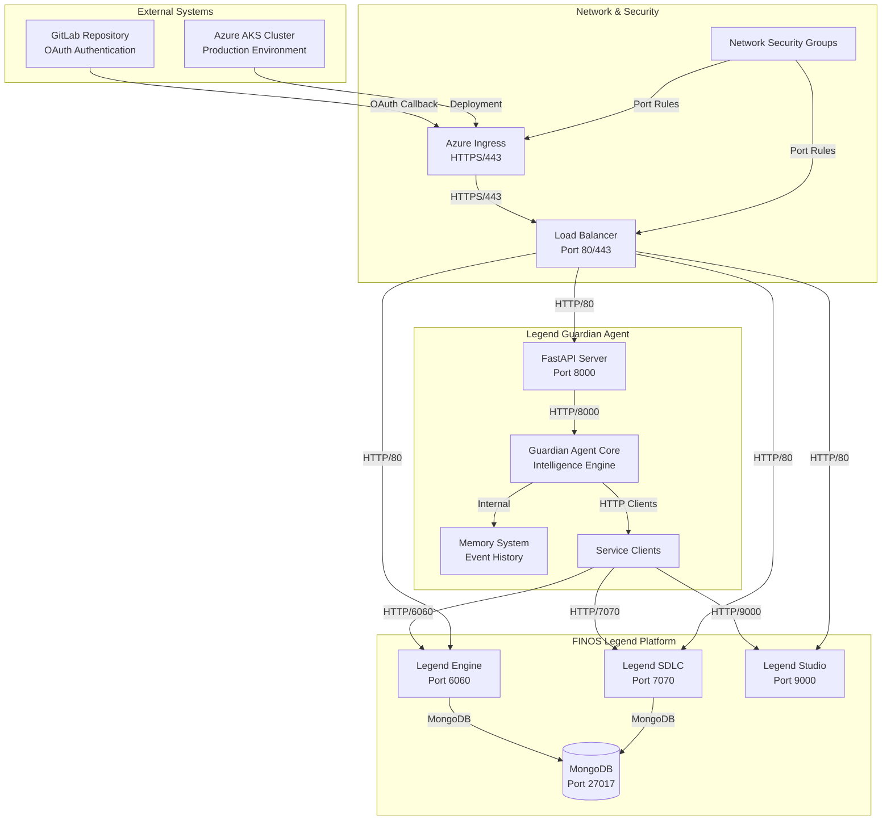
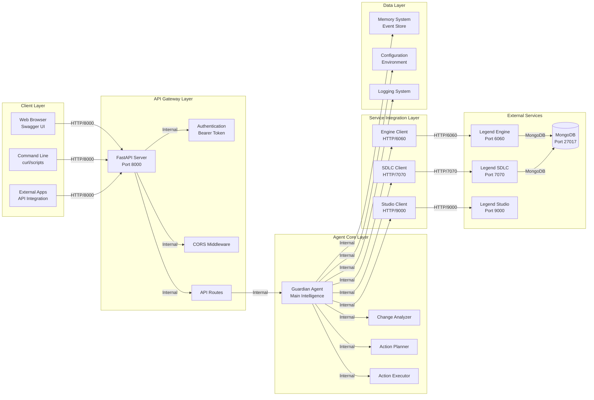
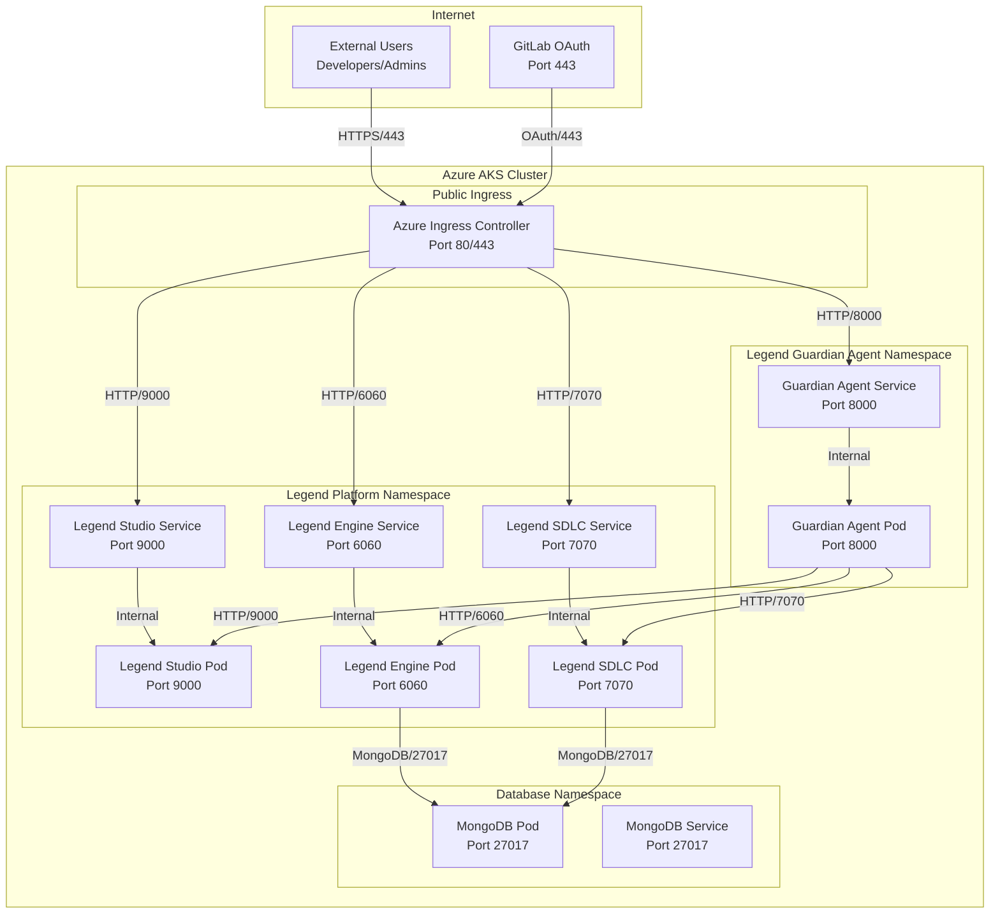
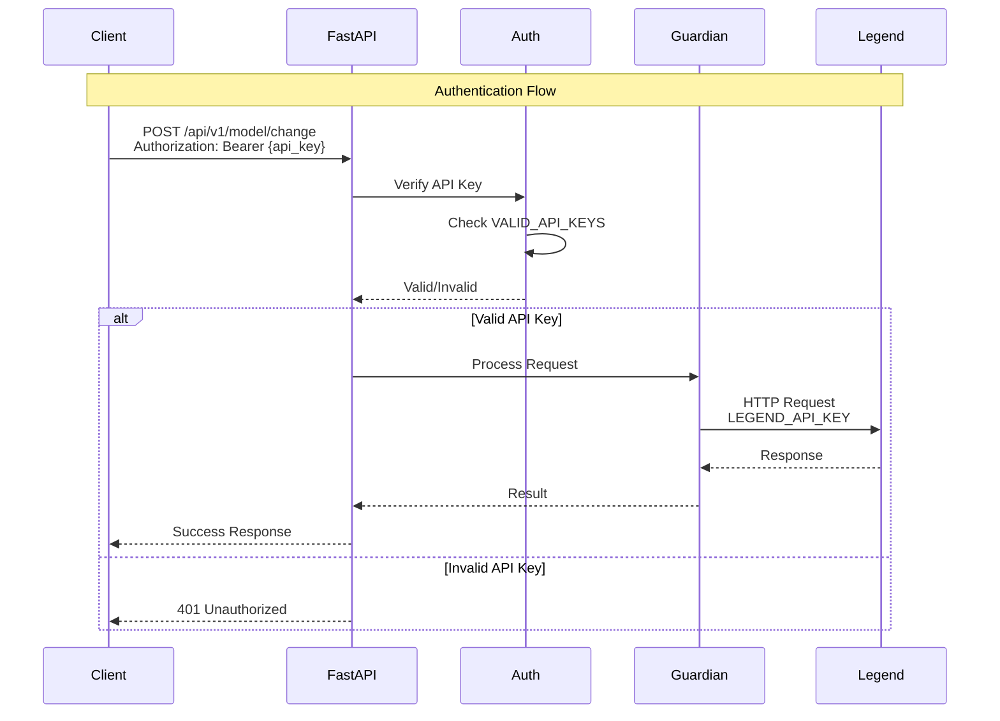
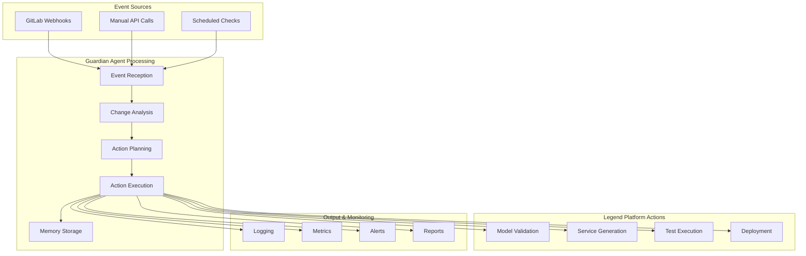
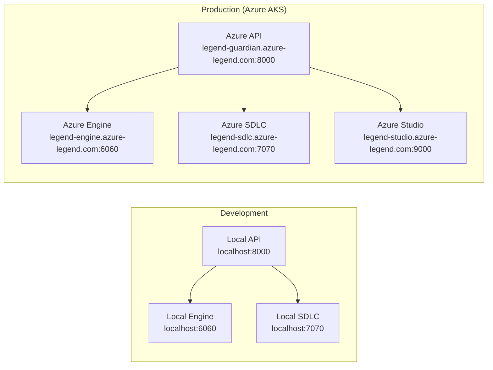

# Legend Guardian Agent - System Architecture

## 🏗️ **High-Level System Architecture**

## 🔌 **Detailed Component Architecture**

## 🌐 **Network Architecture & Ports**

## 🔐 **Authentication & Security Architecture**

## 📊 **Data Flow Architecture**

## 🏷️ **Component Details**

### **Legend Guardian Agent**
- **Port**: 8000
- **Protocol**: HTTP/HTTPS
- **Framework**: FastAPI (Python)
- **Authentication**: Bearer Token (API Keys)
- **Features**: Model monitoring, validation, automation

### **Legend Engine**
- **Port**: 6060
- **Protocol**: HTTP
- **Purpose**: Model execution and validation
- **Database**: MongoDB (Port 27017)

### **Legend SDLC**
- **Port**: 7070
- **Protocol**: HTTP
- **Purpose**: Source control and lifecycle management
- **Database**: MongoDB (Port 27017)

### **Legend Studio**
- **Port**: 9000
- **Protocol**: HTTP
- **Purpose**: Web-based modeling interface
- **Authentication**: GitLab OAuth

### **MongoDB**
- **Port**: 27017
- **Protocol**: MongoDB Wire Protocol
- **Purpose**: Data persistence for all Legend services

### **Azure Ingress**
- **Ports**: 80 (HTTP), 443 (HTTPS)
- **Protocol**: HTTP/HTTPS
- **Purpose**: External access and load balancing

## 🔄 **Deployment Architecture**

## 📋 **Configuration Summary**

| Component | Port | Protocol | Purpose | Authentication |
|-----------|------|----------|---------|----------------|
| **Guardian Agent** | 8000 | HTTP | API Server | API Key (Bearer) |
| **Legend Engine** | 6060 | HTTP | Model Execution | Internal |
| **Legend SDLC** | 7070 | HTTP | Source Control | GitLab OAuth |
| **Legend Studio** | 9000 | HTTP | Web Interface | GitLab OAuth |
| **MongoDB** | 27017 | MongoDB | Data Storage | Internal |
| **Azure Ingress** | 80/443 | HTTP/HTTPS | External Access | Load Balancer |

This architecture provides a scalable, secure, and maintainable system for monitoring and managing the FINOS Legend platform through the Legend Guardian Agent.
