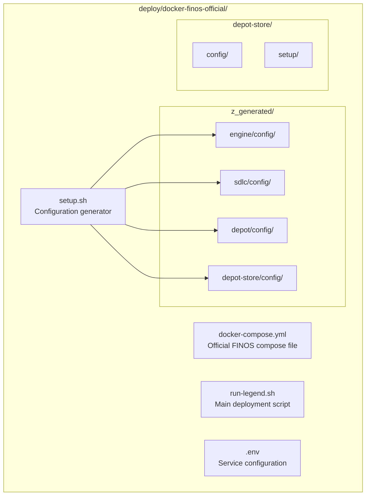

# Atheryon FINOS Legend - System Architecture

## Overview

This project provides a clean, focused deployment of the FINOS Legend platform using Docker. The architecture is designed to be simple, maintainable, and focused solely on Legend platform deployment.

## 🏗️ System Architecture

### High-Level Architecture (Full Stack)

```
┌─────────────────────────────────────────────────────────────────────┐
│                    Atheryon FINOS Legend Platform                    │
├─────────────────────────────────────────────────────────────────────┤
│  ┌──────────────┐  ┌──────────────┐  ┌──────────────┐  ┌──────────────┐ │
│  │   Legend     │  │   Legend     │  │   Legend     │  │   Legend     │ │
│  │   Studio     │  │   Query      │  │   SDLC       │  │   Depot      │ │
│  │  (Port 9000) │  │  (Port 9001) │  │  (Port 6100) │  │  (Port 6200) │ │
│  └──────────────┘  └──────────────┘  └──────────────┘  └──────────────┘ │
├─────────────────────────────────────────────────────────────────────┤
│  ┌─────────────────────────────────────────────────────────────────┐ │
│  │                    Legend Engine (Port 6300)                    │ │
│  │               Core Execution and Model Processing               │ │
│  └─────────────────────────────────────────────────────────────────┘ │
├─────────────────────────────────────────────────────────────────────┤
│  ┌──────────────────────────┐  ┌──────────────────────────────────┐ │
│  │      MongoDB (27017)      │  │      PostgreSQL (5432)          │ │
│  │    Primary Database       │  │    Additional Storage           │ │
│  └──────────────────────────┘  └──────────────────────────────────┘ │
└─────────────────────────────────────────────────────────────────────┘
```

### Service Dependencies

```
Setup Service (One-time configuration generation)
  └── Generates configs for all services

MongoDB (27017) + PostgreSQL (5432)
  ├── Legend Engine (6300)
  │   ├── Legend Studio (9000)
  │   ├── Legend Query (9001)
  │   └── Legend Depot (6200)
  └── Legend SDLC (6100)
      ├── Legend Studio (9000)
      └── GitLab Integration
```

## 🐳 Docker Architecture

### Container Structure (Official FINOS Deployment)



### Docker Compose Profiles

- **setup**: One-time configuration generation
- **engine**: Legend Engine service only
- **sdlc**: Legend SDLC service only
- **studio**: Core modeling stack (Engine + SDLC + Studio + MongoDB)
- **depot**: Model repository services
- **query**: Full stack including data exploration
- **postgres**: PostgreSQL database support

### Network Architecture

- **Network**: `legend-network` (bridge)
- **Internal Communication**: Services communicate via container names
- **External Access**: Ports exposed to host machine
- **Data Persistence**: MongoDB data persisted via Docker volumes

## 🔧 Configuration Architecture

### Configuration Files

- **Engine Config** (`engine-config.yml`): Legend Engine settings
- **SDLC Config** (`sdlc-config.yml`): Legend SDLC settings

### Environment Variables

- **Service Ports**: Configured in docker-compose.yml
- **Database URLs**: MongoDB connection strings
- **Service Dependencies**: Internal service URLs

## 📊 Health Monitoring

### Health Check Endpoints

- **Legend Engine**: `/api/server/v1/info`
- **Legend SDLC**: `/api/health`
- **Legend Studio**: `/` (root endpoint)

### Health Check Configuration

```yaml
healthcheck:
  test: ["CMD", "curl", "-f", "http://localhost:6300/api/server/v1/info"]
  interval: 30s
  timeout: 10s
  retries: 3
```

## 🚀 Deployment Architecture

### Profile-Based Deployment

```bash
cd deploy/docker-finos-official

# One-time setup
./run-legend.sh setup up

# Deploy different profiles
./run-legend.sh studio up -d    # Core modeling stack
./run-legend.sh query up -d     # Full stack with Query
./run-legend.sh engine up -d    # Engine only
```

### Service Startup Order

1. **Setup** - Generate configurations (one-time)
2. **MongoDB/PostgreSQL** - Database backends
3. **Legend Engine** - Model execution engine
4. **Legend SDLC** - Source control (depends on Engine)
5. **Legend Studio** - Web interface (depends on Engine & SDLC)
6. **Legend Depot** - Model repository (optional)
7. **Legend Query** - Data exploration (optional)

## 🔒 Security Architecture

### Network Security

- **Internal Network**: Services communicate via Docker network
- **Port Exposure**: Only necessary ports exposed to host
- **No External Access**: Services not accessible from internet by default

### Data Security

- **MongoDB**: Authentication enabled (admin/admin by default)
- **GitLab OAuth**: Required for all services
- **Service Communication**: Internal network communication only
- **Configuration**: Generated by setup service, stored in z_generated/
- **Secrets**: Managed via secrets.env file (gitignored)

## 📈 Scalability Considerations

### Current Design

- **Single Instance**: Each service runs as single container
- **Resource Limits**: No explicit resource constraints
- **Horizontal Scaling**: Not implemented in current design

### Future Enhancements

- **Load Balancing**: Add reverse proxy (nginx/traefik)
- **Resource Limits**: Implement Docker resource constraints
- **Horizontal Scaling**: Multiple instances of services
- **Persistent Storage**: External volume mounts for production

## 🛠️ Maintenance Architecture

### Logging

- **Container Logs**: Accessible via `docker-compose logs`
- **Log Rotation**: Managed by Docker daemon
- **Centralized Logging**: Not implemented (future enhancement)

### Monitoring

- **Health Checks**: Built-in Docker health checks
- **Metrics Collection**: Not implemented (future enhancement)
- **Alerting**: Not implemented (future enhancement)

### Backup & Recovery

- **MongoDB Data**: Persisted in Docker volumes
- **Configuration**: Stored in version control
- **Backup Strategy**: Manual volume backup (future enhancement)

## 🔄 Update & Deployment

### Service Updates

```bash
# Pull latest official images
docker pull finos/legend-engine-server:latest
docker pull finos/legend-sdlc-server:latest
docker pull finos/legend-studio:latest

# Restart with new images
cd deploy/docker-finos-official
./run-legend.sh studio down
./run-legend.sh studio up -d
```

### Configuration Updates

- **Runtime Updates**: Not supported (requires restart)
- **Configuration Changes**: Modify config files and restart services
- **Version Management**: Docker image versioning

## 📋 Architecture Decisions

### Why Docker Compose?

- **Simplicity**: Single file deployment
- **Development**: Easy local development and testing
- **Consistency**: Same environment across development/production
- **Maintenance**: Simple service management

### Why Official FINOS Images?

- **Reliability**: Official, tested images
- **Updates**: Regular security and feature updates
- **Compatibility**: Guaranteed compatibility with Legend platform
- **Support**: Official support from FINOS

### Why MongoDB?

- **Legend Requirement**: Legend platform requires MongoDB
- **Simplicity**: No complex database setup
- **Performance**: Adequate for development and small deployments
- **Future**: Can be replaced with external MongoDB in production

## 🎯 What This Architecture Does NOT Include

- ❌ **Guardian Agent**: No monitoring or automation
- ❌ **Load Balancing**: No reverse proxy or load balancer
- ❌ **High Availability**: No clustering or failover
- ❌ **External Monitoring**: No Prometheus, Grafana, etc.
- ❌ **CI/CD Pipeline**: No automated deployment
- ❌ **Production Hardening**: No security hardening or resource limits

This architecture is designed for **development, testing, and small production deployments** of the Legend platform.
