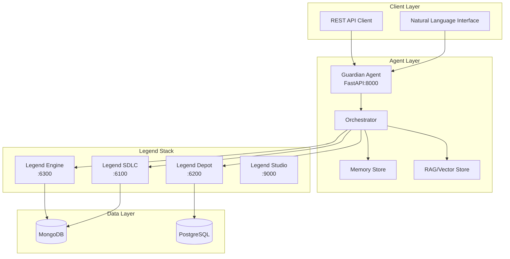

# Legend Guardian Agent

A production-grade agent for orchestrating FINOS Legend stack operations through natural language interfaces.

## Architecture



## Features

- **Natural Language Processing**: Convert user intents into Legend operations
- **Multi-Service Orchestration**: Coordinate across Engine, SDLC, and Depot
- **PURE Compilation & Validation**: Real-time model validation
- **Automated PR/Review Management**: GitLab integration for code reviews
- **Service Generation & Publishing**: Automatic REST API generation
- **Audit Trail**: Complete action logging and artifact generation
- **RAG-Enhanced Context**: Leverage organizational knowledge base
- **Policy Enforcement**: Guardrails for compliance and security

## Quick Start

### Prerequisites

- Docker & Docker Compose
- Python 3.11+
- Legend Stack running (or use Docker Compose profile)

### Local Development

```bash
# Clone the repository
git clone <repo-url>
cd legend-guardian-agent

# Set up environment
cp deploy/local/.env.example .env
# Edit .env with your configuration

# Start Legend stack + Agent
docker compose --profile full up -d

# Or run agent in development mode
make dev

# Run tests
make test

# Run linting
make lint
```

### API Documentation

Once running, access the interactive API documentation:
- Swagger UI: http://localhost:8000/docs
- ReDoc: http://localhost:8000/redoc

## Use Cases

The agent supports 8 primary use cases:

1. **Ingest → Model → Map → Publish Service**: End-to-end data pipeline
2. **Model Change with Safe Rollout**: Versioned schema evolution
3. **Cross-bank Model Reuse via Depot**: Leverage shared models
4. **Reverse ETL → Data Product**: Database to API transformation
5. **Governance Audit & Lineage Proof**: Compliance documentation
6. **Contract-first API**: Schema-driven development
7. **Bulk Backfill & Regression**: Large-scale data processing
8. **Incident Response / Rollback**: Emergency recovery procedures

## Project Structure

```
legend-guardian-agent/
├── src/                    # Source code
│   ├── api/               # FastAPI application
│   ├── agent/             # Orchestration logic
│   ├── clients/           # Legend service clients
│   └── rag/               # RAG/Vector store
├── tests/                 # Test suite
├── deploy/                # Deployment configurations
│   ├── local/            # Docker Compose
│   └── k8s/              # Kubernetes manifests
├── ci/                    # CI/CD pipelines
├── scripts/               # Utility scripts
└── artifacts/             # Generated artifacts
    ├── harness/          # Test harness scripts
    └── docs/             # Documentation
```

## Configuration

Environment variables (see `.env.example`):

```bash
# Legend Services
ENGINE_URL=http://localhost:6300
SDLC_URL=http://localhost:6100
DEPOT_URL=http://localhost:6200
STUDIO_URL=http://localhost:9000

# Agent Configuration
AGENT_URL=http://localhost:8000
API_KEY=demo-key
PROJECT_ID=demo-project
WORKSPACE_ID=terry-dev

# Security
VALID_API_KEYS=demo-key,prod-key
ENGINE_TOKEN=<token>
SDLC_TOKEN=<token>
DEPOT_TOKEN=<token>

# Observability
OTEL_EXPORTER_OTLP_ENDPOINT=http://localhost:4317
LOG_LEVEL=INFO
```

## Testing

```bash
# Run unit tests
make test

# Run specific test
pytest tests/test_engine_client.py -v

# Run test harness (all use cases)
make harness

# Run individual use case
bash artifacts/harness/usecase1_ingest_publish.sh
```

## Deployment

### Docker Compose (Local)

```bash
# Start core services
docker compose up -d

# Start with agent
docker compose --profile full up -d

# View logs
docker compose logs -f agent
```

### Kubernetes (AKS)

```bash
# Create namespace
kubectl apply -f deploy/k8s/namespace.yaml

# Deploy secrets (configure Key Vault first)
kubectl apply -f deploy/k8s/secrets.yaml

# Deploy agent
kubectl apply -f deploy/k8s/

# Check status
kubectl get pods -n legend-guardian
kubectl logs -f deployment/legend-guardian-agent -n legend-guardian
```

## Development

### Code Style

```bash
# Format code
make format

# Lint
make lint

# Type check
make typecheck
```

### Adding New Features

1. Create feature branch: `git checkout -b feature/new-feature`
2. Implement changes with tests
3. Update OpenAPI spec if needed
4. Run full test suite: `make test`
5. Update documentation
6. Submit PR with description

## API Endpoints

### Core Endpoints

- `GET /health` - Health check with dependency status
- `POST /intent` - Process natural language intent
- `POST /adapters/engine/compile` - Compile PURE code
- `POST /adapters/sdlc/workspaces/{id}` - Create workspace
- `GET /adapters/depot/search` - Search depot models

See full OpenAPI specification at `/docs` when running.

## Monitoring

- Health endpoint aggregates all service dependencies
- OpenTelemetry traces for request flow
- Structured logging with correlation IDs
- Metrics exported to Azure Monitor (production)

## Security

- Bearer token authentication for all endpoints
- Secret management via Azure Key Vault (production)
- PII redaction in logs
- Network policies for service isolation
- Automated vulnerability scanning in CI/CD

## Support

- Documentation: `artifacts/docs/`
- Runbook: `artifacts/docs/runbook.md`
- Use Cases: `artifacts/docs/usecases.md`
- Issues: Create issue in repository

## License

Apache 2.0 - See LICENSE file

## Contributing

Please read CONTRIBUTING.md for development guidelines and submission process.