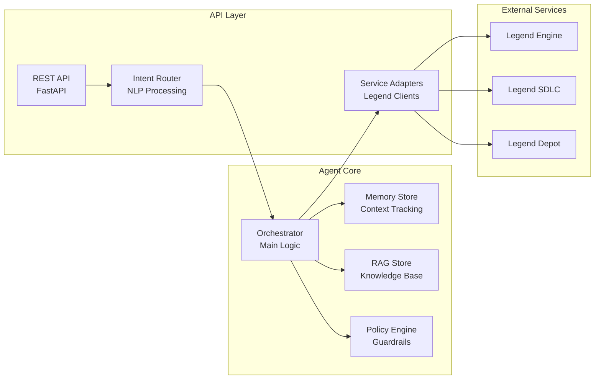

# Legend Guardian Agent

The agent component for orchestrating FINOS Legend stack operations through natural language interfaces.

This directory contains the FastAPI-based agent that provides intelligent orchestration of Legend services. For workspace setup and deployment instructions, see the [root README](../README.md).

## Agent Architecture



## Agent Components

### Core Modules

- **Orchestrator** (`src/agent/orchestrator.py`): Coordinates multi-step workflows across Legend services
- **Memory Store** (`src/agent/memory.py`): Maintains conversation context and state
- **RAG Store** (`src/rag/`): Vector-based knowledge retrieval for enhanced context
- **Policy Engine** (`src/agent/policies.py`): Enforces security and compliance guardrails
- **LLM Client** (`src/agent/llm_client.py`): Interfaces with language models for intent processing

### Service Adapters

- **Engine Client** (`src/clients/engine.py`): PURE compilation, validation, and execution
- **SDLC Client** (`src/clients/sdlc.py`): Workspace management and GitLab integration
- **Depot Client** (`src/clients/depot.py`): Model repository and versioning

### API Routers

- **Intent Router** (`src/api/routers/intent.py`): Natural language processing endpoint
- **Flow Router** (`src/api/routers/flows.py`): Orchestrated workflow execution
- **Adapter Routers** (`src/api/routers/adapters_*.py`): Direct service access
- **Webhook Router** (`src/api/routers/webhooks.py`): Event-driven automation

## Development

### Local Setup

```bash
# From this directory
cd legend-guardian-agent

# Create virtual environment
python -m venv venv
source venv/bin/activate  # On Windows: venv\Scripts\activate

# Install dependencies
pip install -r requirements.txt

# Run in development mode
make dev
```

### Running Tests

```bash
# Unit tests
make test

# Specific test file
pytest tests/test_engine_client.py -v

# With coverage
pytest --cov=src tests/

# Test harness for use cases
make harness
```

### Code Quality

```bash
# Format code with black
make format

# Lint with flake8
make lint

# Type check with mypy
make typecheck

# Run all checks
make check
```

## Agent-Specific Configuration

The agent uses these environment variables beyond the standard Legend service URLs:

```bash
# Agent Features
ENABLE_RAG=true                    # Enable RAG-enhanced responses
ENABLE_MEMORY=true                 # Enable conversation memory
ENABLE_POLICIES=true               # Enable policy enforcement
MAX_RETRIES=3                      # Max retry attempts for failed operations
TIMEOUT_SECONDS=30                 # Default timeout for operations

# LLM Configuration (if using external LLM)
LLM_PROVIDER=openai                # LLM provider (openai, anthropic, etc.)
LLM_MODEL=gpt-4                   # Model to use
LLM_API_KEY=<your-key>            # API key for LLM provider
LLM_TEMPERATURE=0.7                # Response temperature

# RAG Configuration
RAG_CHUNK_SIZE=1000               # Document chunk size
RAG_OVERLAP=200                   # Chunk overlap
RAG_TOP_K=5                       # Number of results to retrieve

# Memory Configuration
MEMORY_TTL_HOURS=24               # How long to retain conversation memory
MEMORY_MAX_TOKENS=4000            # Max tokens to store per conversation
```

## API Endpoints

### Agent-Specific Endpoints

#### Intent Processing
```python
POST /intent
{
    "message": "Create a new data model for trading",
    "context": {
        "project_id": "my-project",
        "workspace_id": "dev"
    }
}
```

#### Flow Execution
```python
POST /flows/execute
{
    "flow_type": "ingest_publish",
    "parameters": {
        "source": "database",
        "target": "api"
    }
}
```

#### Memory Management
```python
GET /agent/memory/{conversation_id}
DELETE /agent/memory/{conversation_id}
```

#### RAG Operations
```python
POST /agent/rag/index
{
    "documents": ["..."],
    "metadata": {...}
}

POST /agent/rag/search
{
    "query": "How to create a data model?",
    "top_k": 5
}
```

## Extending the Agent

### Adding New Intent Handlers

1. Create handler in `src/agent/handlers/`
2. Register in `src/agent/orchestrator.py`
3. Add tests in `tests/test_handlers/`
4. Update intent routing in `src/api/routers/intent.py`

### Adding New Service Adapters

1. Create client in `src/clients/`
2. Add router in `src/api/routers/`
3. Register in `src/api/main.py`
4. Add integration tests

### Custom Policies

1. Define policy in `src/agent/policies.py`
2. Add to policy chain in orchestrator
3. Test with various scenarios
4. Document in policy catalog

## Performance Tuning

### Caching
- Redis-backed caching for frequent queries
- TTL-based invalidation
- Cache warming on startup

### Connection Pooling
- HTTP connection pooling for Legend services
- Configurable pool sizes
- Health check intervals

### Async Operations
- Fully async FastAPI implementation
- Concurrent service calls where possible
- Background task processing

## Monitoring & Observability

### Metrics
- Request latency by endpoint
- Service call success rates
- Intent recognition accuracy
- Memory and RAG hit rates

### Logging
- Structured JSON logging
- Correlation IDs for request tracing
- Sensitive data redaction
- Log levels: DEBUG, INFO, WARN, ERROR

### Tracing
- OpenTelemetry integration
- Distributed tracing across services
- Span attributes for debugging

## Security Considerations

### Authentication
- Bearer token validation
- API key rotation support
- Service-to-service auth tokens

### Authorization
- Role-based access control
- Project/workspace isolation
- Operation-level permissions

### Data Protection
- PII detection and redaction
- Encryption at rest and in transit
- Audit logging for compliance

## Troubleshooting

### Common Issues

#### Agent Won't Start
- Check Legend services are running: `curl http://localhost:6300/api/server/v1/info`
- Verify environment variables are set
- Check port 8000 is available

#### Intent Not Recognized
- Review intent patterns in system prompts
- Check LLM connectivity (if using external)
- Verify RAG index is populated

#### Service Timeouts
- Increase TIMEOUT_SECONDS
- Check network connectivity to Legend services
- Review service logs for errors

### Debug Mode

```bash
# Enable debug logging
LOG_LEVEL=DEBUG make dev

# Enable request/response logging
DEBUG_HTTP=true make dev

# Disable caching for testing
DISABLE_CACHE=true make dev
```

## Contributing

See [CONTRIBUTING.md](../CONTRIBUTING.md) for general guidelines.

### Agent-Specific Guidelines

1. **Intent Handlers**: Must be idempotent and handle partial failures
2. **Service Clients**: Use retry logic with exponential backoff
3. **Memory Store**: Implement cleanup for expired entries
4. **RAG Updates**: Include source attribution for retrieved content
5. **Policy Engine**: Default to restrictive, require explicit allows

## License

Apache 2.0 - See [LICENSE](LICENSE) file